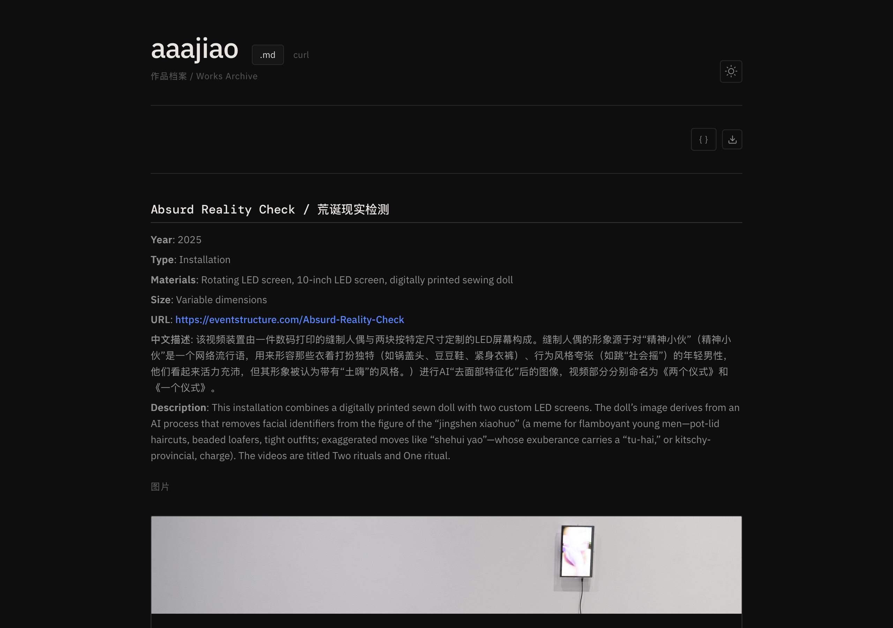
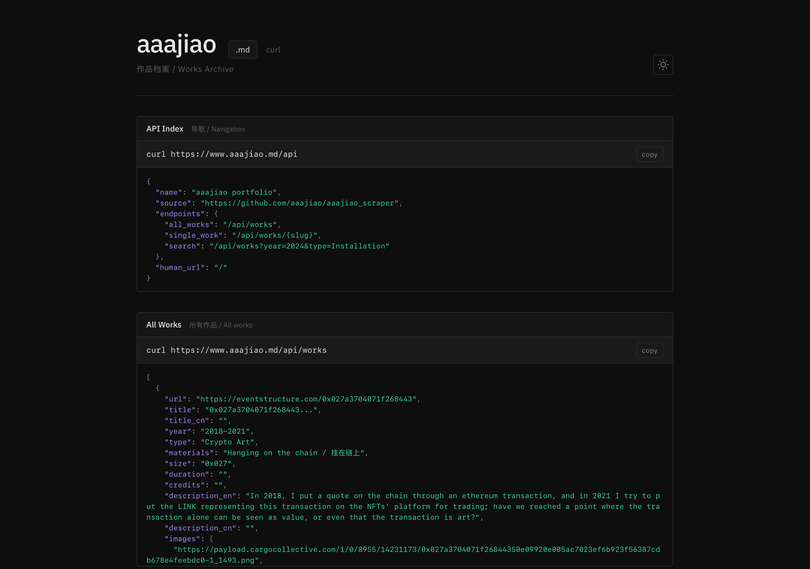
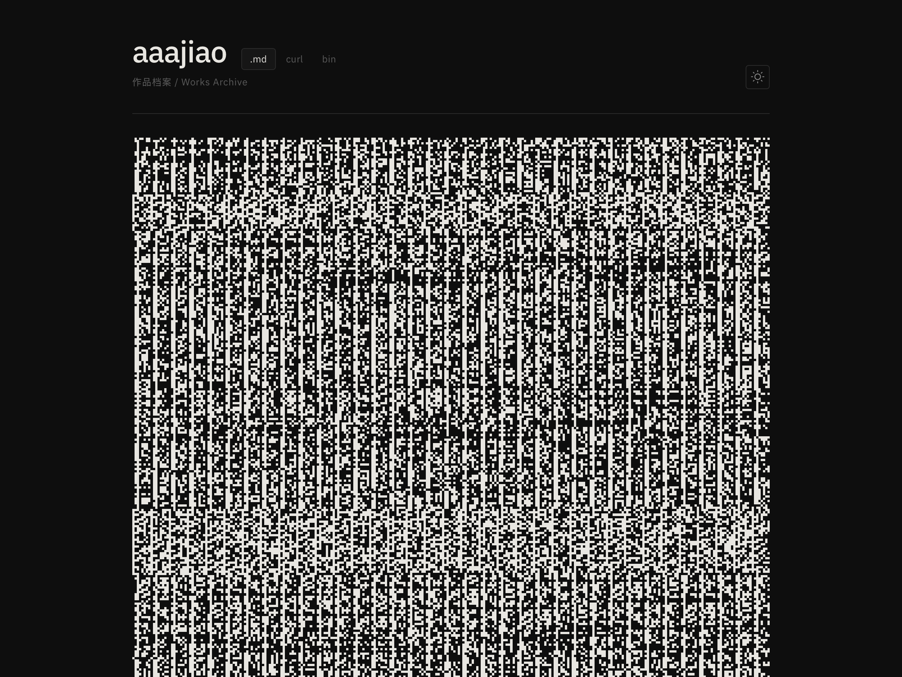

# aaajiao.md

One URL, three views. A portfolio site for contemporary artist [aaajiao](https://eventstructure.com) that presents the same artwork data at three levels of abstraction.

- **`.md`** — human-readable Markdown via [Streamdown](https://github.com/vercel/streamdown)
- **`curl`** — interactive API explorer with live JSON responses
- **`bin`** — bit-pixel bitmap: every byte of JSON rendered as 8 pixels, hover/click to decode
- **AI agents** hit `/api/*` and get structured JSON

From Markdown to structured data to raw binary — the same information, three ways of seeing.

| `.md` tab | `curl` tab | `bin` tab |
|-----------|------------|-----------|
|  |  |  |

No local data copy. All work data is fetched at runtime from the [aaajiao_scraper](https://github.com/aaajiao/aaajiao_scraper) repo on GitHub.

## API

```bash
# Index / navigation
curl https://aaajiao.md/api

# All works
curl https://aaajiao.md/api/works

# Filter by year or type
curl "https://aaajiao.md/api/works?year=2024"
curl "https://aaajiao.md/api/works?type=Installation"

# Single work by slug
curl https://aaajiao.md/api/works/guard-i
```

All responses are JSON with CORS enabled.

## Stack

- **Frontend**: React 19 + Vite + Tailwind CSS v4 + Streamdown
- **API**: Vercel Serverless Functions (Node.js)
- **Data**: GitHub raw JSON (cached 5 min, no redeploy needed)
- **Runtime**: Bun

## Development

```bash
bun install          # install dependencies
bun run dev          # vite dev server (frontend only)
vercel dev           # full local dev (frontend + API)
bun run build        # production build
```

## Architecture

```
Browser (/)                          AI (curl /api/*)
    |                                      |
    +-- fetch /api/works ---+              |
    |                       v              v
    |              Vercel Serverless Functions
    |              GitHub raw JSON -> return
    |                       |
    v                       |
  App.tsx                   |
    -> sort by year desc    |
    -> .md tab: Streamdown  |
       + JSON overlay       |
    -> curl tab: live API   |
       explorer             |
    -> bin tab: bit-pixel   |
       bitmap + decode      |
```

## License

MIT
