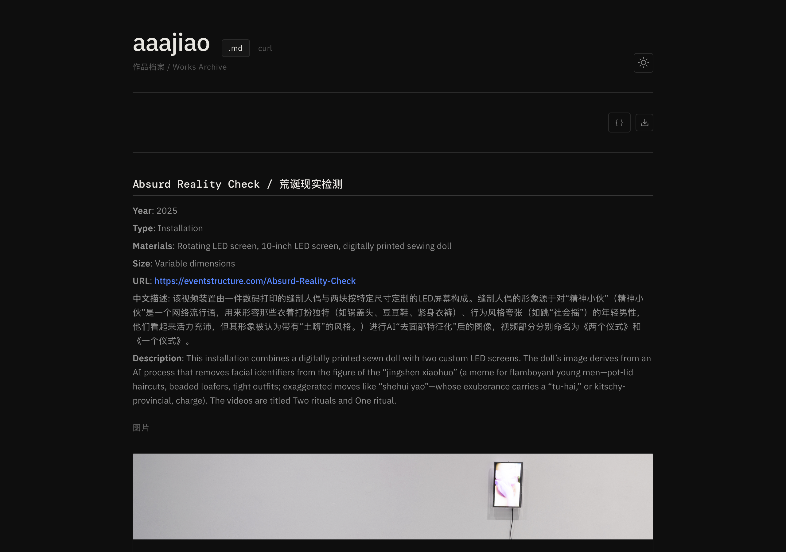
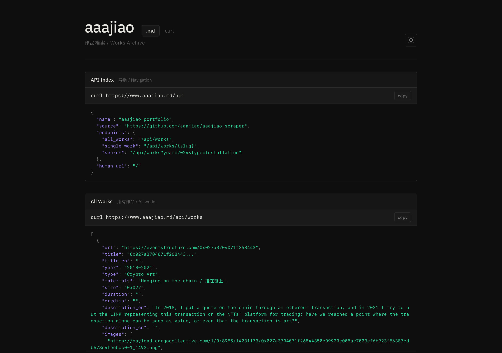
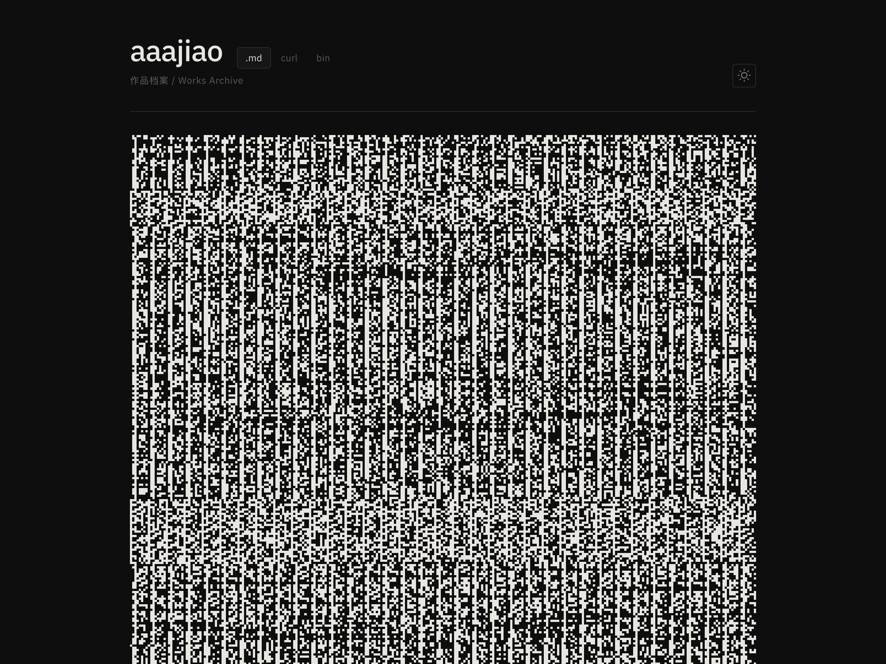

# aaajiao.md

One URL, three views. A portfolio site for contemporary artist [aaajiao](https://eventstructure.com) that presents the same artwork data at three levels of abstraction.

- **`.md`** — human-readable Markdown via [Streamdown](https://github.com/vercel/streamdown)
- **`curl`** — interactive API explorer with live JSON, Markdown, and binary responses
- **`bin`** — bit-pixel bitmap: every byte of JSON rendered as 8 pixels, hover/click to decode, ambient breathing animation decodes fields sequentially using [Pretext](https://github.com/chenglou/pretext)
- **AI agents** hit `/api/*` and get structured JSON

From Markdown to structured data to raw binary — the same information, three ways of seeing.

| `.md` tab | `curl` tab | `bin` tab |
|-----------|------------|-----------|
|  |  |  |

No local data copy. All work data is fetched at runtime from the [aaajiao_scraper](https://github.com/aaajiao/aaajiao_scraper) repo on GitHub.

## Agent Skill

This repo contains an **aaajiao agent skill** — a distillation of the artist's conceptual framework, critical methodology, and voice into a format that AI agents can load and use. It follows the [Agent Skills](https://agentskills.io) open standard.

- **[`skills/aaajiao/SKILL.md`](skills/aaajiao/SKILL.md)** — core distillation: identity, double helix framework, concept-as-filter methodology, vocabulary, voice rules
- **`docs/`** — knowledge base: interview transcripts, project documents, letters, media coverage (58 articles + 40 PDFs)

All reference documents are public in this repo. The skill reads them via GitHub raw URLs — no local files needed.

### Install

**One command** — installs to all your AI agents (Claude Code, Codex, OpenClaw, Cursor, etc.):

```bash
npx skills add aaajiao/aaajiao.md --all
```

Or pick a specific agent:

```bash
npx skills add aaajiao/aaajiao.md -a claude-code
npx skills add aaajiao/aaajiao.md -a codex
npx skills add aaajiao/aaajiao.md -a openclaw
```

Install globally (`-g`) to make it available across all your projects:

```bash
npx skills add aaajiao/aaajiao.md --all -g
```

**Update** — the skill evolves as new works and interviews are added:

```bash
npx skills update
```

**Without CLI** — you can also tell your agent to read the skill directly:

```
Read https://raw.githubusercontent.com/aaajiao/aaajiao.md/main/skills/aaajiao/SKILL.md
```

The `docs/` knowledge base lives on GitHub and is always fetched fresh by the agent at runtime.

## API

```bash
# Index / navigation
curl https://aaajiao.md/api

# All works (JSON, default)
curl https://aaajiao.md/api/works

# Filter by year or type
curl "https://aaajiao.md/api/works?year=2024"
curl "https://aaajiao.md/api/works?type=Installation"

# Single work by slug
curl https://aaajiao.md/api/works/guard-i
```

### Content Negotiation

Same URL, different `Accept` header — three representations:

```bash
# Markdown (with YAML front-matter)
curl -H "Accept: text/markdown" https://aaajiao.md/api/works

# Raw bytes (UTF-8 encoded JSON)
curl -H "Accept: application/octet-stream" https://aaajiao.md/api/works -o works.bin

# Single work as Markdown
curl -H "Accept: text/markdown" https://aaajiao.md/api/works/guard-i
```

All responses include CORS headers and `Content-Signal: ai-input=yes, ai-train=yes, search=yes`.

## Stack

- **Frontend**: React 19 + Vite + Tailwind CSS v4 + Streamdown + [Pretext](https://github.com/chenglou/pretext)
- **API**: Vercel Serverless Functions (Node.js)
- **Data**: GitHub raw JSON (cached 5 min, no redeploy needed)
- **Runtime**: Bun

## Development

```bash
bun install          # install dependencies
bun run dev          # vite dev server (frontend only)
vercel dev           # full local dev (frontend + API)
bun run build        # production build
```

## Architecture

```
Browser (/)                          AI (curl /api/*)
    |                                      |
    +-- fetch /api/works ---+              |
    |                       v              v
    |              Vercel Serverless Functions
    |              GitHub raw JSON -> cache -> negotiate
    |              Accept: json | markdown | binary
    |              + Content-Signal header
    |                       |
    v                       |
  App.tsx                   |
    -> sort by year desc    |
    -> .md tab: Streamdown  |
       + JSON overlay       |
    -> curl tab: live API   |
       explorer + content   |
       negotiation demos    |
    -> bin tab: bit-pixel   |
       bitmap + decode      |
       + breathing (Pretext) |
```

## License

MIT
